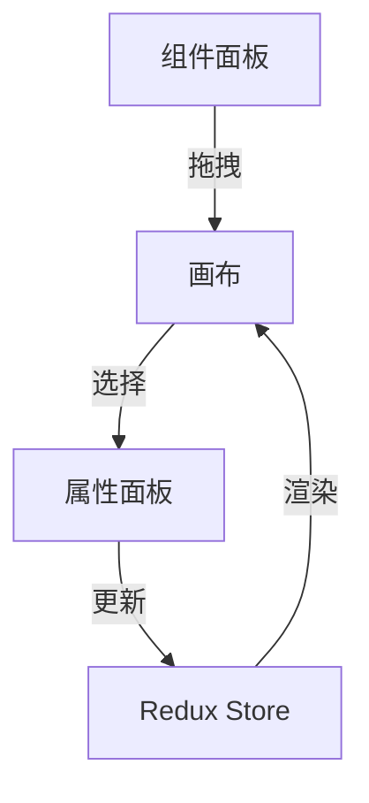

# 技术设计方案

## 1. 系统架构

### 1.1 技术栈选型
- 前端框架：React 18 + Next.js 14
- 状态管理：Redux Toolkit
- CSS 框架：Tailwind CSS
- 组件库：Shadcn/ui（基于 Tailwind）
- 拖拽实现：react-dnd
- 数据库：MongoDB（存储页面配置和组件数据）
- API层：Next.js API Routes
- 部署：Vercel

### 1.2 项目结构 
project/
├── src/
│ ├── app/ # Next.js 路由
│ ├── components/ # 共享组件
│ │ ├── editor/ # 编辑器相关组件
│ │ └── ui/ # 基础 UI 组件
│ ├── features/ # 业务功能模块
│ │ ├── page-management/ # 页面管理模块
│ │ └── page-editor/ # 页面编辑器模块
│ ├── lib/ # 工具函数
│ ├── store/ # Redux store
│ └── types/ # TypeScript 类型定义
└── public/ # 静态资源


## 2. 核心功能设计

### 2.1 页面管理模块
#### 数据模型

typescript:document/技术设计.md
interface Page {
id: string;
title: string;
route: string;
seo: {
title: string;
description: string;
keywords: string;
}
components: Component[];
createdAt: Date;
updatedAt: Date;
}

#### 主要功能
- 页面 CRUD 接口
- 路由管理
- TDK 配置

### 2.2 页面编辑器模块
#### 组件系统设计

```typescript
interface Component {
id: string;
type: string;
props: {
style: ComponentStyle;
data: ComponentData;
}
}
interface ComponentStyle {
width?: string | number;
height?: string | number;
margin?: string | number;
padding?: string | number;
color?: string;
backgroundColor?: string;
fontSize?: string | number;
}
interface ComponentData {
text?: string;
src?: string;
alt?: string;
link?: string;
}
```

#### 编辑器功能
- 组件拖拽画布
- 组件属性面板
- 实时预览
- 自动保存
- 组件删除

### 2.3 预览系统
- 实时预览
- 响应式预览（计划中）

## 3. 状态管理设计

### 3.1 Redux Store 结构
```typescript
interface RootState {
editor: {
components: Component[];
selectedComponent: Component | null;
isDragging: boolean;
draggingComponent: Component | null;
undoStack: Component[][];
redoStack: Component[][];
}
}
```


### 3.2 主要 Actions
- setComponents
- setSelectedComponent
- updateComponent
- deleteComponent
- setIsDragging
- setDraggingComponent

## 4. API 设计

### 4.1 页面管理 API
- GET /api/pages - 获取页面列表
- POST /api/pages - 创建新页面
- PUT /api/pages/:id - 更新页面信息
- DELETE /api/pages/:id - 删除页面

## 5. 性能优化策略
- React.memo 优化
- 组件懒加载
- 状态更新优化
- 自动保存节流

## 6. 安全考虑
- API 认证授权
- XSS 防护
- 数据验证

## 7. 后续扩展计划
- 组件嵌套支持
- 撤销/重做功能
- 组件复制/粘贴
- 响应式预览
- 快捷键支持

# 编辑器技术设计

## 1. 架构设计

### 1.1 核心模块

```
src/
├── components/
│   └── editor/
│       ├── components/       # 可编辑组件
│       ├── layout/          # 编辑器布局
│       └── common/          # 通用组件
├── config/                  # 配置
├── store/                   # 状态管理
├── types/                   # 类型定义
└── services/               # 数据服务
```

### 1.2 数据流



## 2. 组件系统

### 2.1 组件注册

```typescript
// src/components/editor/components/index.ts
import { ComponentType } from '@/types/component';

// 组件注册表
export const componentConfigs = {
  [ComponentType.TEXT]: TextConfig,
  [ComponentType.IMAGE]: ImageConfig,
  [ComponentType.BUTTON]: ButtonConfig,
  [ComponentType.CONTAINER]: ContainerConfig,
};

// 组件获取API
export function getComponentConfig(type: ComponentType) {
  return componentConfigs[type];
}

export function getAvailableComponents() {
  return Object.values(componentConfigs);
}
```

### 2.2 组件渲染

```typescript
// src/components/editor/ComponentRenderer.tsx
const componentMap = {
  [ComponentType.TEXT]: Text,
  [ComponentType.IMAGE]: Image,
  [ComponentType.BUTTON]: Button,
  [ComponentType.CONTAINER]: Container,
};

export function ComponentRenderer({ component, isPreview }) {
  const ComponentToRender = componentMap[component.type];
  const config = getComponentConfig(component.type);

  const style = {
    ...config?.defaultProps.style,
    ...component.props.style,
  };

  const data = {
    ...config?.defaultProps.data,
    ...component.props.data,
  };

  return <ComponentToRender style={style} data={data} />;
}
```

## 3. 拖拽实现

### 3.1 拖拽上下文

```typescript
// src/components/DndProvider.tsx
export function DndProvider({ children, onDragEnd }) {
  const [tempComponent, setTempComponent] = useState(null);

  const handleDragStart = (start) => {
    if (start.source.droppableId === 'component-panel') {
      const config = getComponentConfig(start.draggableId);
      setTempComponent(createComponent(config));
    }
  };

  return (
    <DragDropContext
      onDragStart={handleDragStart}
      onDragEnd={handleDragEnd}
    >
      {children}
    </DragDropContext>
  );
}
```

### 3.2 拖拽区域

```typescript
// Canvas组件
<Droppable droppableId="canvas">
  {(provided, snapshot) => (
    <div
      ref={provided.innerRef}
      {...provided.droppableProps}
      style={getDropAreaStyle(snapshot.isDraggingOver)}
    >
      {components.map((component, index) => (
        <DraggableComponent
          key={component.id}
          component={component}
          index={index}
        />
      ))}
      {provided.placeholder}
    </div>
  )}
</Droppable>
```

## 4. 状态管理

### 4.1 Store 结构

```typescript
interface EditorState {
  components: Component[];
  selectedComponent: Component | null;
  isDragging: boolean;
  draggingComponent: Component | null;
  history: {
    past: Component[][];
    present: Component[];
    future: Component[][];
  };
}
```

### 4.2 Action 定义

```typescript
const editorSlice = createSlice({
  name: 'editor',
  initialState,
  reducers: {
    setComponents: (state, action) => {
      state.components = action.payload;
    },
    setSelectedComponent: (state, action) => {
      state.selectedComponent = action.payload;
    },
    updateComponent: (state, action) => {
      const index = state.components.findIndex(c => c.id === action.payload.id);
      if (index !== -1) {
        state.components[index] = action.payload;
      }
    },
    deleteComponent: (state, action) => {
      state.components = state.components.filter(c => c.id !== action.payload);
    },
  },
});
```

## 5. 属性编辑

### 5.1 编辑器配置

```typescript
interface ComponentEditor {
  label: string;
  type: 'text' | 'number' | 'color' | 'select' | 'switch';
  field: string;
  options?: Array<{
    label: string;
    value: any;
  }>;
  min?: number;
  max?: number;
  step?: number;
}
```

### 5.2 属性面板实现

```typescript
function PropertyPanel({ component, onUpdate }) {
  const config = getComponentConfig(component.type);
  
  return (
    <Tabs>
      <TabPane key="style" tab="样式">
        {config.editors.style.map(editor => (
          <EditorField
            key={editor.field}
            editor={editor}
            value={component.props.style[editor.field]}
            onChange={handleStyleChange}
          />
        ))}
      </TabPane>
      <TabPane key="data" tab="数据">
        {config.editors.data.map(editor => (
          <EditorField
            key={editor.field}
            editor={editor}
            value={component.props.data[editor.field]}
            onChange={handleDataChange}
          />
        ))}
      </TabPane>
    </Tabs>
  );
}
```

## 6. 性能优化

1. 组件缓存
   - 使用 React.memo
   - 优化重渲染条件
   - 实现组件懒加载

2. 状态优化
   - 选择器记忆化
   - 状态扁平化
   - 批量更新处理

3. 渲染优化
   - 虚拟滚动
   - 组件分片渲染
   - 延迟加载

## 7. 扩展性设计

1. 组件扩展
   - 标准化组件接口
   - 插件化组件注册
   - 自定义组件支持

2. 编辑器扩展
   - 自定义编辑器
   - 主题定制
   - 快捷键配置

3. 数据扩展
   - 数据源配置
   - 模板系统
   - 导入导出支持